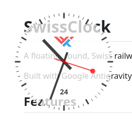

# SwissClock

A floating, round, Swiss railway clock for Linux desktops.

Built with Google Antigravity. Thanks Uncle Goog.



## Features

- **Authentic Design**: Classic Swiss railway clock face.
- **Floating Window**: No window decorations, circular shape.
- **Movable**: Click and drag to move the clock anywhere on your screen.
- **Stay on Top**: Option to keep the clock above other windows.
- **Adjustable Opacity**: Scroll up/down on the clock to change transparency.
- **Click Through**: "Ghost mode" allows you to click through the clock to windows behind it.
- **Resizable**: Adjust the clock size via the context menu.

## Dependencies

- **Qt6**: Core and Widgets modules.
- **X11**: libX11, libXshape, libXfixes.
- **CMake**: Version 3.16 or higher.
- **C++ Compiler**: Supporting C++17.

## Build Instructions

1.  Clone the repository:
    ```bash
    git clone <repository-url>
    cd vibe-antigravity-clock
    ```

2.  Create a build directory:
    ```bash
    mkdir build
    cd build
    ```

3.  Run CMake and make:
    ```bash
    cmake ..
    make
    ```

## Usage

1.  Run the application:
    ```bash
    ./SwissClock
    ```

2.  **Right-click** the clock to access the context menu:
    - Toggle "Stay on Top"
    - Toggle "Click Through" (To exit Click Through mode, use the system tray icon)
    - Set Size (Small, Medium, Large)
    - Quit

3.  **Scroll** over the clock to adjust opacity.

4.  **Drag** the clock to move it.
